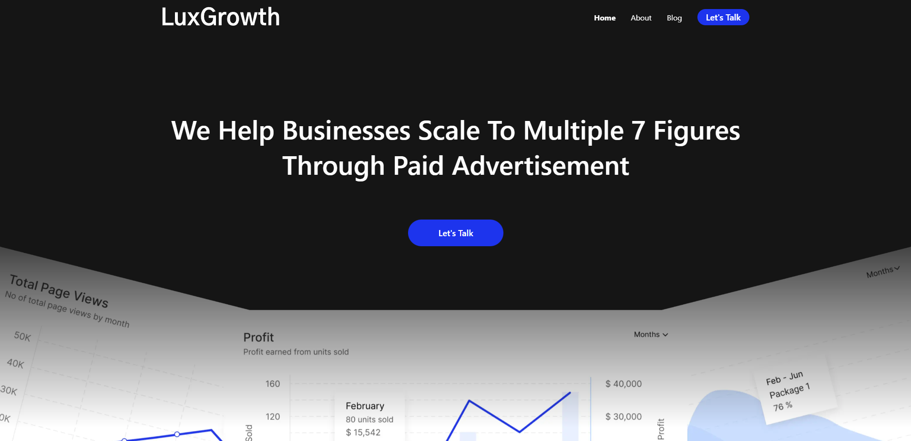
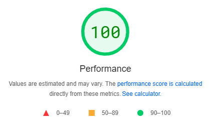

# SmmaWebsite
This is a responsive website for social media marketing agency. Website is live [here.](https://www.luxgrowth.io) and hosted with Netlify

What is included in the website:
- Landing Page, using calendly for booking calls
- About Page
- Blog Page, with 2 blog posts
- Policies Page
- Newsletter, using mailchimp

