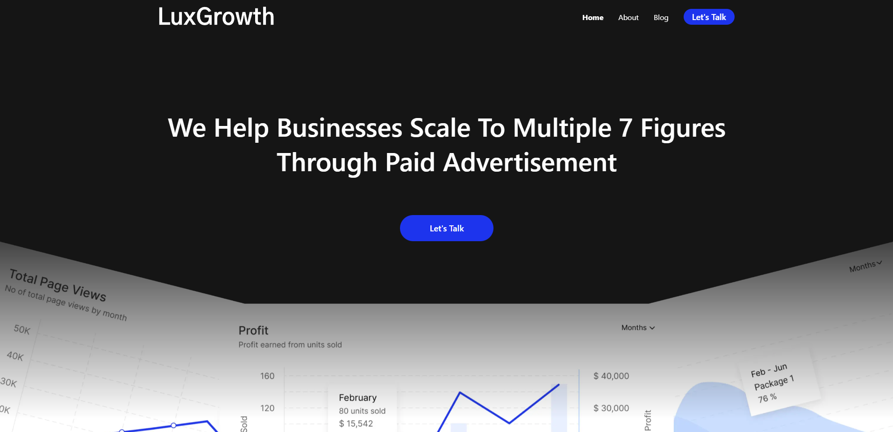

# SmmaWebsite
This is a responsive website for social media marketing agency

What is included in the website:
- Landing Page, using calendly for booking calls
- About Page
- Blog Page
- Policies Page
- Newsletter, using mailchimp

